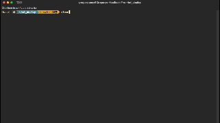

# Sentiment Analysis for Movie Reviews

## Project Description

This project encompasses the design, construction, and implementation of a sentiment analysis service for movie reviews. It demonstrates the deployment of a machine learning model as both a Function-as-a-Service (FaaS) using AWS Lambda and as a containerized microservice using Docker. A simple web interface is provided to showcase the functionality to stakeholders. The primary objective of this project was to gain hands-on experience in deploying machine learning models as scalable and efficient microservices.

## Skills Utilized

- Natural Language Processing (NLP)
- **AWS Lambda** for serverless deployment
- **Docker** for containerization
- **Flask** as the web server framework
- Basic **HTML** and **CSS** for front-end presentation
- Model deployment and operationalization

### Demo


## Business Case

The company's platform allows for user-generated movie reviews that directly influence the overall product ratings. The objective is to automate the evaluation of these reviews, accurately classifying them as positive or negative. This automation will significantly refine the rating process, ensuring consistency and objectivity while also accommodating the growing volume of user feedback.

## Project Accomplishments

1. **Model Training**: Developed a sentiment analysis model using Python's NLTK library to classify movie reviews as positive or negative.

2. **API Endpoint**: Leveraged AWS Lambda to host the model, creating a callable API endpoint for real-time sentiment analysis.

3. **Model Deployment**: Deployed the model within a Docker container, utilizing Flask as the web server to handle incoming requests.

4. **Front-End Demonstration**: Constructed a mini-website that interacts with the model, allowing stakeholders to input movie reviews and instantly view the sentiment analysis results.

## How to Run the Project


- Install Docker. Check that it has installed correctly:
```console
docker --version
```
- Pull repository and cd into the project:
```console
git clone https://github.com/GregoryTomy/sentiment-service.git
cd sentiment-service
```
- Run docker compose
```console
docker-compose up --build
```
- Open the address by copy-pasting the url. This is what it will look like: "Running on http://127.0.0.1:4000"

- Enter a review and click submit.

